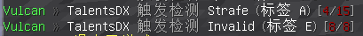
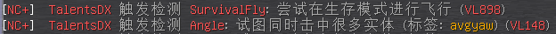
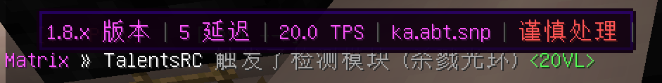
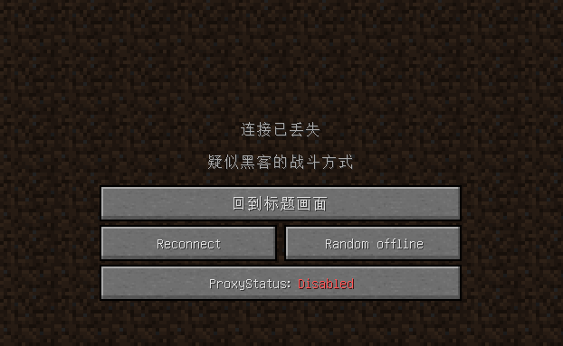
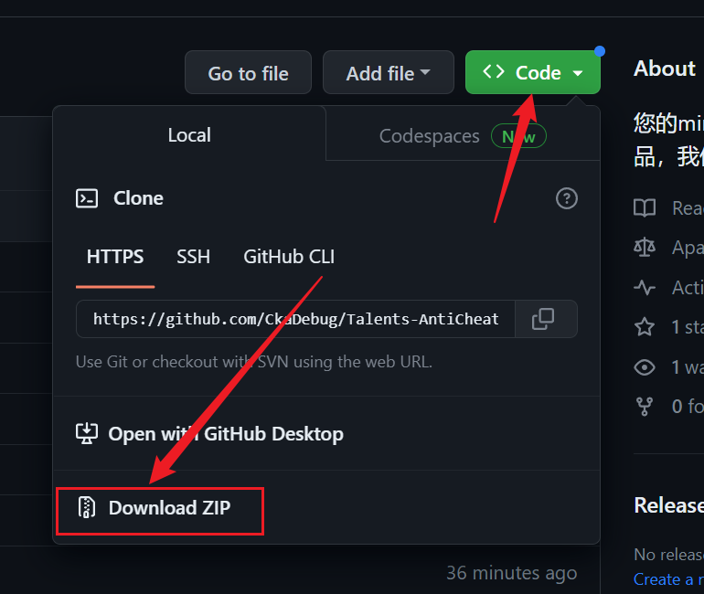
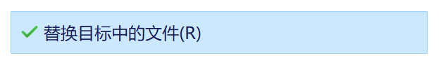

*(Translation from NetEase Youdao)*

 

 
 ## 🛡Talents-AntiCheat-Config🛡
 
### Configuration ***optimization** for multiple anti-cheats

### From the hands of the malpractice user of 2017-2024

#### **“It's not about the money.”**

##### MineBBS:[click view](https://www.minebbs.com/resources/talents-anticheat-config.7557/)

---

✨Features✨
 
- Customize for gameplay
- Increase detection speed
- Restricted error flag
- Interesting adjustments
- full free

---
 

###  **📷预览📷**

- Language improvement *（Alert message improvement）*

#### Currently only Chinese language is available

---
 

 
### **⭐Support for anti-cheating⭐**
Ultimately, you still need these anti-cheat plugins to use the configuration

- [Matrix](https://matrix.rip) 
- [NocheatPlus](https://github.com/Updated-NoCheatPlus/NoCheatPlus) 
- [NocheatPlus-Dreeam](https://github.com/Winds-Studio/NoCheatPlus)(Performance optimized version)
- [GrimAC](https://grim.ac) 
- [AntiAura](https://www.spigotmc.org/resources/antiaura-%C2%BB-reliable-cheat-detection-%C2%BB-anti-cheat-plugin.1368/update?update=16048) 
- [Vulcan](https://www.spigotmc.org/resources/vulcan-anti-cheat-advanced-cheat-detection-1-7-1-19.83626/) *no recommend*
- [SoaromaSAC](https://www.spigotmc.org/resources/soaromasac-lightweight-cheat-detection-system-for-java-bedrock.87702/)  
- [Themis](https://www.spigotmc.org/resources/themis-anti-cheat-1-17-1-18-1-19-bedrock-support-paper-compatibility-free-optimized.90766/) 
- [Hawk](https://github.com/HawkAnticheat/Hawk) 
- [Foxaddition](https://www.spigotmc.org/resources/foxaddition-anti-cheat-1-7-2-1-20-4-geyser-support.111260/) 
 ### Support but not guarantee stability
 （Always avoid using anti-cheats abandoned by authors, as they can only detect ancient features and have no new maintenance）
- [AAC](https://www.spigotmc.org/resources/aac-advanced-anti-cheat-hack-kill-aura-blocker.6442)
- [TakaAC](https://www.spigotmc.org/resources/taka-anticheat-takaac-cheap-and-reliable-solution.45167/) 
- [Horizon](https://www.spigotmc.org/resources/horizon-powerful-cheat-detection-in-new-era-1-8-1-12-1-13-1-14.65830/) 
- [KauriAC](https://www.spigotmc.org/resources/kauri-anticheat-best-in-class-performance-destroy-cheaters-1-7-10-1-18-1.53721/)
- [Spartan](https://www.spigotmc.org/resources/spartan-advanced-anti-cheat-cheat-detection-hack-blocker-1-7-1-19-2-10-summer-sale.25638)
- [AntiCheatReloaded](https://www.spigotmc.org/resources/anticheatreloaded.23799/)
- [Negativityv2](https://www.spigotmc.org/resources/negativity-v2-1-8-to-1-20-bungee-velocity-sponge-fabric-minestom.86874/) Do not use, crash exists!
 
---

### 🔧How to install🔧

#### 1.Download the warehouse locally

####  2.Replace the original anti-cheat configuration (yml) file.

####  3.Restart your server.

#### 4.Enjoy!!!

---