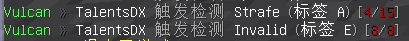
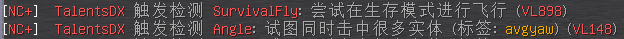
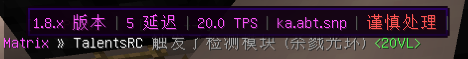
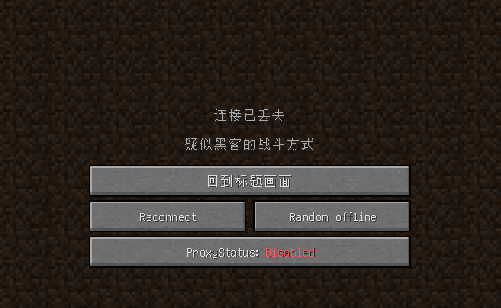
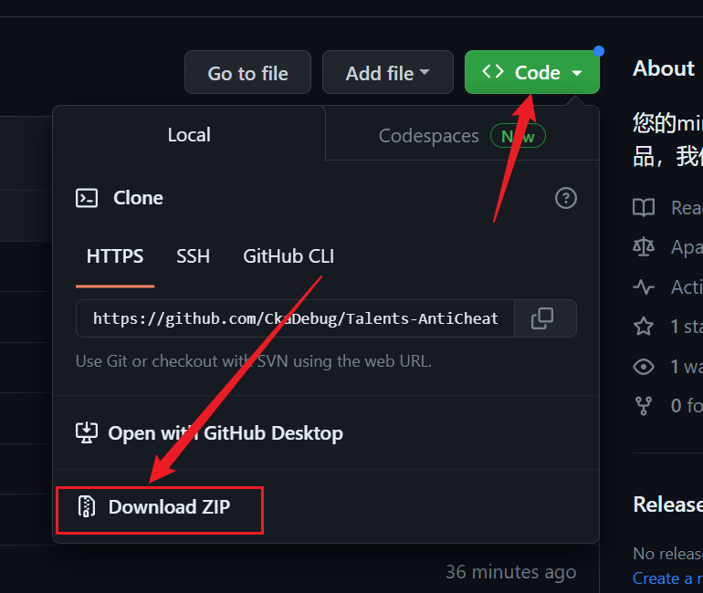
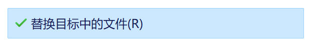
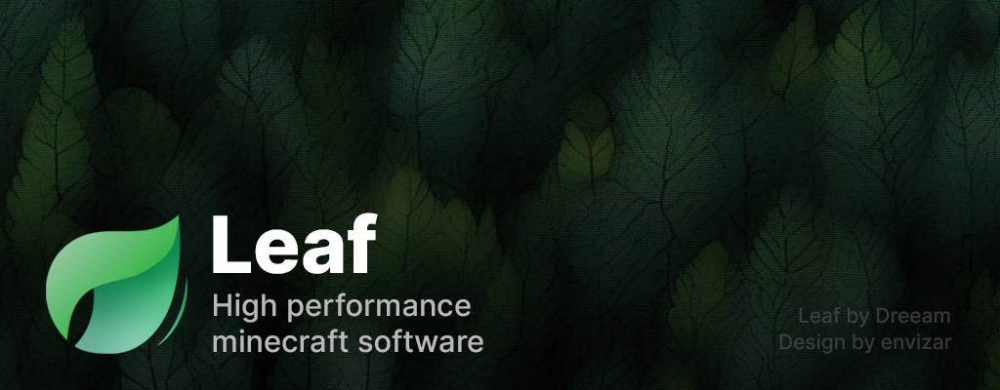

# ⚠️前言 ⚠️

[English](https://github.com/CkaDebug/Talents-AntiCheat-Config/blob/main/English-config/en-readme.md)

> ---
> 
> 不要对此配置进行**发布**或**出售**并声称是你的**原创**配置
>
> ## 👇一些使用我配置并出售倒卖且声称是自己原创的人们👇
>
> [小友老师](https://postyizhan.github.io/lezi-wiki/article/%E5%B0%8F%E5%8F%8B%E8%80%81%E5%B8%88)
> 
>
> ---
> 
> 本配置是 **免费制作** 
>
> 用来替换那些付费反作弊配置
> 
> **免费标签** 并不代表它很*垃圾*
> 
> 那就花钱去买与我 **相差无几** 付费反作弊配置
>
> 
> ---
> 
> 联系我？
>
> QQ: 1787766313
>
> (Email) 1787766313@QQ.COM
>
> ---
> 另外的话
> 
> 您需要使用最新版Protocollib和Litebans来使用本配置
>
> 如果您不需要或者没有Litebans插件
>
> 请自行替换掉配置里的Litebans:kick指令

---

 

*icon for bing*
 
 ## 🛡人才反作弊配置🛡
 
### 尝试针对多种反作弊在各种玩法的服务器上进行 **优化** 的配置

### 出自2017-2024的作弊端用户之手

#### **“别人在倚老卖老但我在以老带新，只为了给名利场刮点清风。”**

##### MineBBS介绍页:[点击转跳](https://www.minebbs.com/resources/talents-anticheat-config.7557/)

---

✨特点✨
 
- 针对不同玩法服务器定制
- 近乎99%汉化的警报消息 
- 提升反作弊检测速度
- 减少反作弊误判
- 独特的参数调配
- 完全免费

#### *你们这些所有付费反作弊配置作者*

#### *以为随便调些垃圾就能随便糊弄人*

#### *写不了反作弊只能卖参数赚钱多少有点。。*

---
 

###  **📷预览📷**
- 语言修改 *（改进反作弊的消息提示）*

---
 

 
### **⭐我在调整的反作弊插件列表⭐**
*包含（过时配置）文件的不会进行任何问题处理，因为反作弊插件早已被作者抛弃*

- [Matrix](https://matrix.rip) 
- [NocheatPlus](https://github.com/Updated-NoCheatPlus/NoCheatPlus) 
- [GrimAC](https://grim.ac) 
- [AntiAura](https://www.spigotmc.org/resources/antiaura-%C2%BB-reliable-cheat-detection-%C2%BB-anti-cheat-plugin.1368/update?update=16048) 
- [Vulcan](https://www.spigotmc.org/resources/vulcan-anti-cheat-advanced-cheat-detection-1-7-1-19.83626/) 
- [SoaromaSAC](https://www.spigotmc.org/resources/soaromasac-lightweight-cheat-detection-system-for-java-bedrock.87702/)  
- [Themis](https://www.spigotmc.org/resources/themis-anti-cheat-1-17-1-18-1-19-bedrock-support-paper-compatibility-free-optimized.90766/) 
- [Hawk](https://github.com/HawkAnticheat/Hawk) 
- [Foxaddition](https://www.spigotmc.org/resources/foxaddition-anti-cheat-1-7-2-1-20-4-geyser-support.111260/) 
- [AAC](https://www.spigotmc.org/resources/aac-advanced-anti-cheat-hack-kill-aura-blocker.6442)
- [TakaAC](https://www.spigotmc.org/resources/taka-anticheat-takaac-cheap-and-reliable-solution.45167/) 
- [Horizon](https://www.spigotmc.org/resources/horizon-powerful-cheat-detection-in-new-era-1-8-1-12-1-13-1-14.65830/) 
- [KauriAC](https://www.spigotmc.org/resources/kauri-anticheat-best-in-class-performance-destroy-cheaters-1-7-10-1-18-1.53721/)
- [Spartan](https://www.spigotmc.org/resources/spartan-advanced-anti-cheat-cheat-detection-hack-blocker-1-7-1-19-2-10-summer-sale.25638) 💀[一些猛料](https://github.com/TalentsRC/Talents-anticheat-config/blob/main/.github/fucking-spartan.md)💀
- [AntiCheatReloaded](https://www.spigotmc.org/resources/anticheatreloaded.23799/)
- [Negativityv2](https://www.spigotmc.org/resources/negativity-v2-1-8-to-1-20-bungee-velocity-sponge-fabric-minestom.86874/) 
 
---

### 🔧如何使用🔧

#### 1.把配置下载到本地

####  2.替换掉原先反作弊的配置(yml)文件。

####  3.重新启动你的服务器。

#### 4.享受反作弊！

---

 💗我参考以及直接使用的配置💗
 
### 如果 *没有* 这些反作弊做参考，本项目也不会伟大，感谢这些配置作者！
 

- [Winds-anticheat-config](https://github.com/Winds-Studio/winds-anticheat-config) 

- [Flex-AntiCheat](https://github.com/ItsMennyo/Flex-AntiCheat) (R.I.P)

- [MatrixChecks](https://github.com/Encode42/MatrixChecks) （R.I.P)

- TAC v1/v2/v3/v4 (R.I.P)

- Matrix7Checks （R.I.P）

---

## 🎶稍等一下🎶

### 在离开之前，请先看看其他的优秀项目!!

 
⠀
⠀

<h5>Leaf是一款来自国人Dreeam-qwq对 <a href="https://github.com/GaleMC/Gale">Gale</a> 进行fork的服务器核心版本，它删除了一些原版的检测并添加了可能最好的优化补丁，可能是目前最有潜力的优化服务器核心</h5>
<h8>Logo图标来自 <a href="https://github.com/envizar">envizar</a></h8>

---

  

    
  

  <b>
    [乐子Wiki](https://github.com/postyizhan/lezi-wiki)
  </b>
  

    集百处之乐，成一家之言
  

</a>

---
